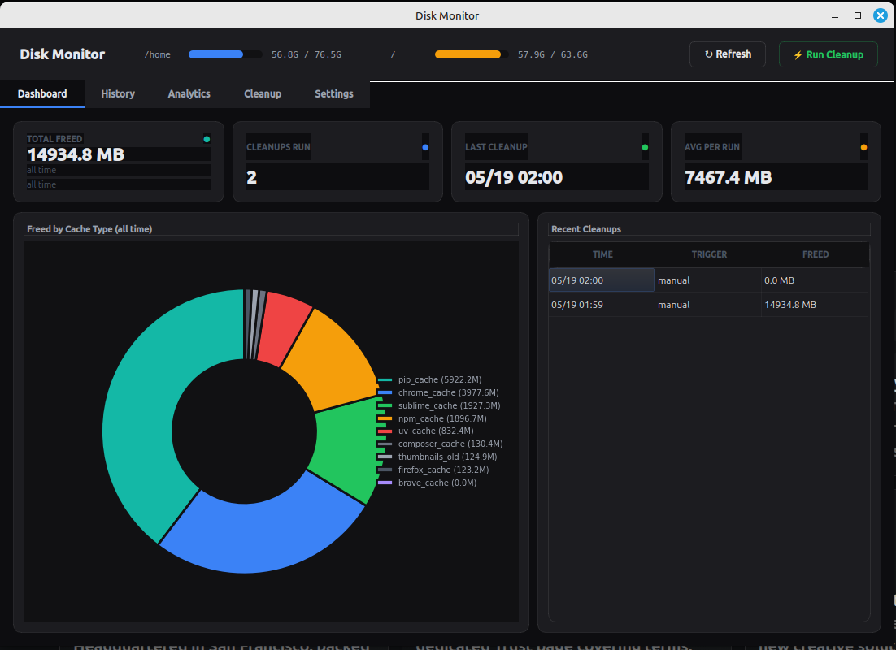
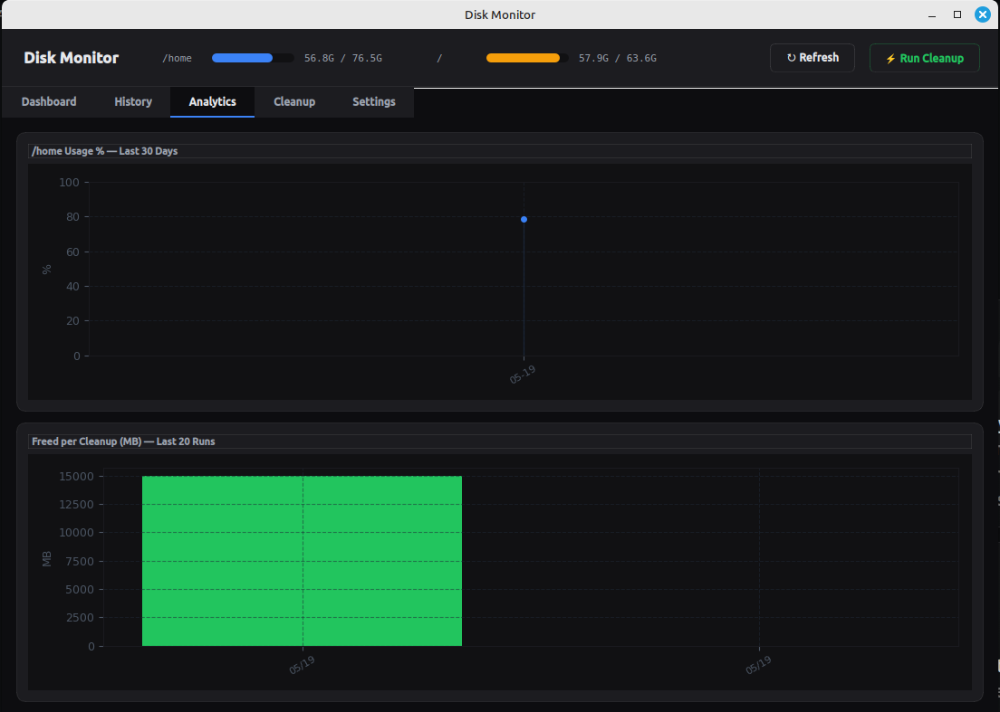
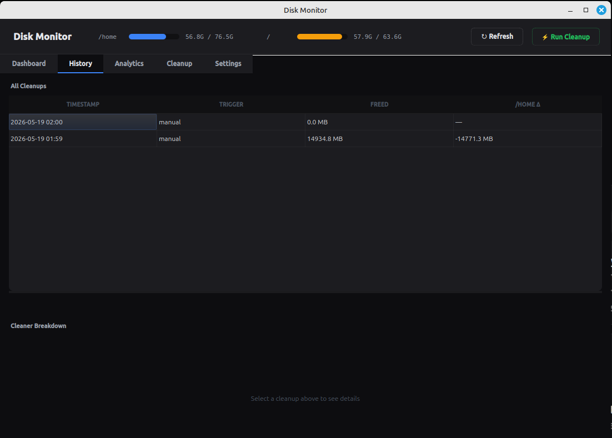
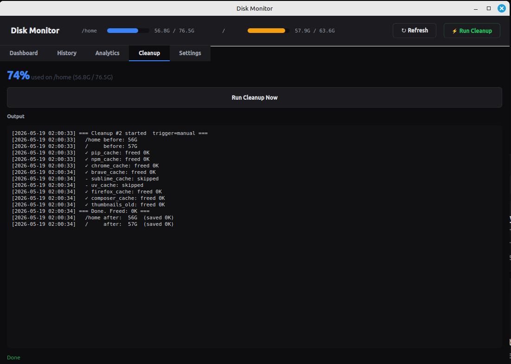
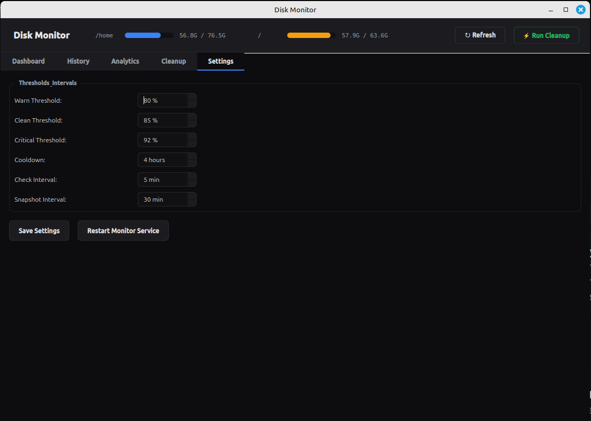

# disk-monitor

**Automatic disk cache cleaner with analytics dashboard for Linux.**

Watches your disk partitions, cleans caches when thresholds are hit, and gives you a full PyQt5 dashboard with charts, cleanup history, and trend analysis — all logged to a local SQLite database.

---

## Features

- **Auto-cleanup daemon** — monitors `/home` and `/` every 5 minutes, triggers cleanup at configurable thresholds
- **Smart cache cleaner** — pip, npm, Chrome, Brave, Firefox, Sublime Text, uv, Composer, thumbnails
- **Desktop notifications** — alerts you when a partition hits critical levels
- **Analytics dashboard** (GUI) — donut charts, usage trend lines, cleanup history, per-cleaner breakdown
- **CLI stats viewer** — full terminal report with 14-day trend table
- **SQLite logging** — every action, byte freed, and disk snapshot is recorded
- **Systemd integration** — monitor runs as a user service; weekly scheduled cleanup via timer
- **Configurable** — thresholds, cooldowns, and intervals via a single config file

---

## Screenshots

### Dashboard — stat cards + freed-by-cache donut chart


### Analytics — disk usage trend + freed per cleanup


### History — full cleanup log with per-cleaner breakdown


### Cleanup — live output from disk-cleaner


### Settings — configure thresholds and intervals


---

## Requirements

| Dependency | Purpose | Install |
|---|---|---|
| Python 3.8+ | disk-gui | pre-installed on most distros |
| PyQt5 | GUI framework | `pip install PyQt5` |
| matplotlib | Charts | `pip install matplotlib` |
| sqlite3 | Stats database | `sudo apt install sqlite3` |
| bash 4+ | Cleaner scripts | pre-installed |
| systemd | Service management | standard on Ubuntu/Fedora/Arch |

---

## Installation

### One-liner
```bash
git clone https://github.com/YOUR_USERNAME/disk-monitor.git
cd disk-monitor
bash install.sh
```

### What the installer does
1. Installs `sqlite3` via your system package manager if missing
2. Copies scripts to `~/.local/bin/` (already in PATH on most distros)
3. Installs systemd user services and timer
4. Starts the monitor daemon immediately
5. Schedules a weekly cleanup

---

## Usage

### GUI Dashboard
```bash
disk-gui
```
Or search **"Disk Monitor"** in your application launcher.

### Manual cleanup (with live output)
```bash
disk-cleaner
```

### Terminal stats report
```bash
disk-stats
```

### Check monitor status
```bash
systemctl --user status disk-monitor.service
systemctl --user list-timers disk-cleaner.timer
```

### View live monitor log
```bash
tail -f ~/.local/share/disk-monitor/monitor.log
```

---

## Configuration

Edit `~/.config/disk-monitor/config.sh`:

```bash
# Thresholds (% of partition used)
WARN_THRESHOLD=80       # log a warning
CLEAN_THRESHOLD=85      # trigger auto-clean silently
CRITICAL_THRESHOLD=92   # trigger clean + desktop alert

# Partitions to watch
MONITOR_PARTITIONS=("/home" "/")

# How long to wait before triggering again (seconds)
COOLDOWN=14400          # 4 hours

# How often the monitor checks disk usage (seconds)
CHECK_INTERVAL=300      # 5 minutes

# How often to record a snapshot for trend charts (seconds)
SNAPSHOT_INTERVAL=1800  # 30 minutes
```

Changes take effect after restarting the monitor:
```bash
systemctl --user restart disk-monitor.service
```

Or edit everything from the **Settings** tab in `disk-gui`.

---

## What gets cleaned

| Cache | Location | Notes |
|---|---|---|
| pip | `~/.cache/pip` | Python package download cache |
| npm | `~/.npm` | Node.js package cache |
| Chrome | `~/.cache/google-chrome` | Cache dirs only — profile data kept |
| Brave | `~/.cache/BraveSoftware` | Cache dirs only |
| Firefox | `~/.cache/mozilla` | `cache2` dirs only |
| Sublime Text | `~/.cache/sublime-text` | Full index cache |
| uv | `~/.cache/uv` | Python uv package manager cache |
| Composer | `~/.cache/composer/files` | PHP Composer package cache |
| Thumbnails | `~/.cache/thumbnails` | Files older than 30 days |

---

## Data & logs

All data is stored in `~/.local/share/disk-monitor/`:

| File | Contents |
|---|---|
| `stats.db` | SQLite database — all cleanups, actions, disk snapshots |
| `actions.log` | Human-readable log of every cleanup run |
| `monitor.log` | Daemon log — threshold crossings, triggers |

---

## How it works

```
disk-monitor (daemon)
    └── checks disk every 5 min
        ├── records snapshot to stats.db every 30 min
        └── if threshold hit → runs disk-cleaner

disk-cleaner (script)
    ├── measures each cache dir before/after
    ├── records every action to stats.db
    └── sends desktop notification (if auto-triggered)

disk-gui (PyQt5 app)
    ├── reads stats.db directly
    ├── shows live disk usage via shutil.disk_usage()
    └── runs disk-cleaner via QProcess (live output)

disk-stats (script)
    └── queries stats.db and prints formatted tables
```

---

## Uninstall

```bash
bash uninstall.sh
```

This stops and removes the systemd services, removes scripts from `~/.local/bin/`, and optionally removes all data.

---

## Contributing

Pull requests welcome. Some ideas for contributions:
- Add more cache locations (yarn, pnpm, cargo, gradle, maven)
- macOS support (launchd instead of systemd)
- Email/webhook alerts for critical threshold
- PKGBUILD for AUR
- Flatpak manifest for Flathub
- RPM spec file for Fedora

Please open an issue before starting large changes.

---

## License

GPL v3 — see [LICENSE](LICENSE).

Free to use, modify, and distribute. If you distribute a modified version, you must open-source your changes under the same license.
